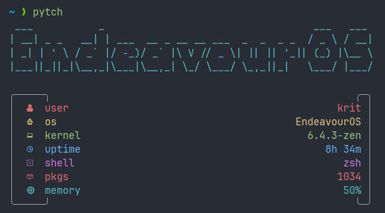

# pyftch

#### A lightweight and elegant fetch for Linux written in Python with no dependencies.

 

## Description

Pyftch is a small and efficient fetch script inspired by [nitch](https://github.com/ssleert/nitch) and [pfetch](https://github.com/dylanaraps/pfetch). It has a relatively fast execution time of ~20ms and is tested on Python versions 3.7 or newer and PyPy (it will probably work on earlier versions but has not been tested as such). It is configured by editing its source code, though the Python used is relatively simple and readable. Rest assured, if you do not understand something, open up an issue and I will be happy to explain it to you. At its current state, Pyftch only supports a few popular Linux distributions (see [this function](https://github.com/kritdass/pyftch/blob/873ffd62d048b7b27da0153ab21e70eb92f7efe5/src/pyftch/__main__.py#L426) for a list though most are not tested). If support is lacking for your distribution, please open up an issue and I will add support for your distribution. Pull requests are welcome and encouraged, please do not hesitate.

## Installation

```
  $ pip install pyftch
```
You will need a [Nerd Font](https://www.nerdfonts.com/) to see the icons. I use [JetFlow](https://github.com/kritdass/JetFlow).
